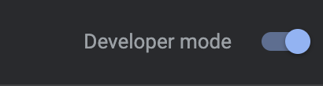
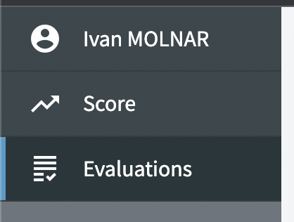
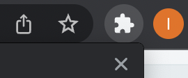
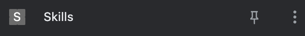
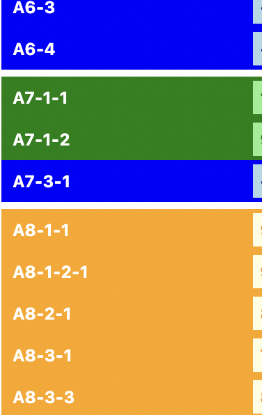

# skills_display
This project is temporary solution to help vizualise the points given by ALGOSUP to its students while school website is still being developped.

This project has been realised by Molnar Ivan and Louis De Lavenne.

## Disclaimers

- This project is still in Beta and therefore is still prone to changes during developpement.
- The exact method in which points move from sub-activites to higher-order activites is yet to be disclosed by the school, therefore these are currently not calculated by the product.

# Installation

To install the project, you first need to download or clone this repository.
<u>We had percieved that sometimes, when you clone the repository, the "manifest.json" file does not download with the rest and it might need to be downloaded manually.</u>

Once downloaded, you will have to open a chrome browser and go to ``settings > extentions`` and select ``Developper mode`` in the top-right corner of the window.

Then, click on ``Load unpacked`` on the top-left and select the entire project folder.

# Usage

It is our objective to simplify this as much as possible. Constructive criticism and ideas are both welcome.

To use the product you just simply have to go to the "Evaluations" tab on your ALGOSUP profile then open the plugin.

In the list that appears you will see a list of the activites you have notes from, sorted by activity.
Red means your note on the activity is below 50%, yellow means you are above 50% and green means your highest note is 95% or above (and therefore not a problem anymore).

