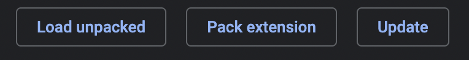

# skills_display
This project is temporary solution to help vizualise the points given by ALGOSUP to its students while school website is still being developped.

This project has been realised by Molnar Ivan and Louis De Lavenne.

## Disclaimers

- This project is still in Beta and therefore is still prone to changes during developpement.
- The point system which we base ourselves on is also still in developpement and is also prone to changes. 

- Because of the way points are currently calculated, the points themselves are only really useful as the coefficients used to calculate the difference between activities. However, as students need to achieve at least 50% in every activity, these points are highly meaningless to the students themselves. Therefore, in this project we sorely focus on working with the percentages of the notes accumulated.

# Installation

To install the project, you first need to download or clone this repository.
<u>We had percieved that sometimes, when you clone the repository, the "manifest.json" file does not download with the rest and it might need to be downloaded manually.</u>

Once downloaded, you will have to open a Chromium (Chrome, Modzilla, Opera, etc..) browser and go to ``settings > extentions`` and select ``Developper mode`` in the top-right corner of the window.

Then, click on ``Load unpacked`` on the top-left and select the entire project folder.

# Usage

It is our objective to simplify this as much as possible. Constructive criticism and ideas are both welcome.

To use the product you just simply have to go to the `Evaluations` or `Activities` tab on your ALGOSUP profile then open the plugin.

In `Evaluations`, in the list that appears you will see a list of the activites you have notes from, sorted by activity.
Red means your note on the activity is below 50%, yellow means you are above 50% and green means your highest note is 95% or above (and therefore not a problem anymore). Blue means there is no data available on the subject.

In `Activities`, a skill tree will appear, it represents the 8 major skills and their branches, the most important points are those in the major categories, 50% in one of them means you have the necessary number of points in the said skill to finish the school. In red the branches under 50% and in green the ones above.

The description of the activites can be seen when hovering over the title of the activity in `Evaluations` and over a circle in `Activities`

